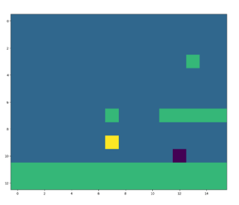

# MarioRL
Projeto de reinforcement learning, cujo objetivo é treinar um agente para jogar super mario bros utilizando tecnicas de RL.
Nesse projeto foram abordados duas técnicas distintas, o Q-learning tabular e o o DDQL(double deep Q-learning)

# Q-learning tabular
Essa técnica consiste em armazenar em uma tabela bidimensional Q(s,a) uma médida do quão positivo é para o agente realizar a ação "a" estando no estado "s".

Para calcular esses valores da tabela, utiliza-se uma técnica denomida programação dinâmica. Inicialmente os valores dessa tabela são inicializados como zero, em cada uma das interações,com uma determinada probabilidade, escolhe-se uma ação aleatoria (etapa de exploração), do contrário escolhe a melhor ação no momento (etapa de exploitação). Por fim, o valor da tabela é atualizado segundo a formula:   

  

Após cada interação, o ambiente retorna uma imagem de dimensões (84X84X3), se fosse utilizado essa imagem como um estado, seriam necessários uma quantidade enorme de memória para representar todos os estados, o que tornaria impossível utilizar o método tabular. Para solucioanr esse problema, foi utilizado a implementação do seguinte github https://github.com/yumouwei/super-mario-bros-reinforcement-learning/tree/main para poder converter a imagem para uma com mais informações.

  

Utilizando as classes SMB, SBMGRIB e SMBWRAPPER, foi possível converter uma imagem de (84,84,3) em uma de tamanho (16,16) como mostrado na figura acima, de modo que: 

- -1: representa o inimigo
- 0: espaço vazio
- 1: tiles
- 2: Mario

Assim foi possível atraves de uma iteração em cada ciclo da imagem identificar a posição do mário dos inimigos e com isso converter a imagem em um vetor de bits que será o estado que representará a imagem

Foi utilizado um vetor com 13 bits, com os seguintes significados

- bit para verificar se o mario está no chão
- um bit para identificar se ele pode pular
- três bits para identificar se existem inimigos perto, a media distância ou longe
- um bit para ver se ele tomou um hit de um inimigo
- três bits para identificar se existe um obstáculo a frente
- três bits para identificar se existe um obstáculo próximo
- Um bit para identificar se ele matou um inimigo

Com relação a recompensa (R), foram utilizadas os seguinte critérios:

- v = x2 - x1: bonificar se ele andou para frente
- c = c0 - c1: penalisar pela demora de tempo
- d = 0 se vivo e d = -15 se morto
- R = v + c + d

Além disso foi criado uma função para penalisar o mário caso ele pule em momentos dencessários, como quando não há obstáculos, precipicios ou inimigos.

# DDQL

O deep q-learning, utiliza o mesmo principio do tabular de explorar e exploitar, porém ao invés de armazenar a informação em uma tabela Q(s,a), ele cria uma rede neural que dado um estado S, retorna um vetor que representa a tendencia que o agente possui de escolher cada uma das possíveis ações. Assim com a rede treinada, bastaria passar a imagem que representa o estado pela rede e em seguida escolher a ação com o maior resultado. Assim será necessário treinar a rede.

O double deep q-learning segue esse principio, porém ele utiliza duas redes neurais, uma para determinar o valor estimado para a saida da rede, e a outra para definir o target para então ser realizado o backpropagation.
Outra caracteristica consiste em armazenar as utlimas iterações em buffer para que possa ser amostrado um bacth que será utilizado para treinar a rede. O objetivo disso é permitir que o agente utilize mais de uma vez a interação para poder tomar suas decisões, visto que em um jogo com muitos estados, a repetição acaba sendo raro.

A classe principal do código consiste na classe Mario,a qual possui as seguintes funções

- Act: Selecionar a ação
- cache: Armazenar os estados
- recall: Amostrar o batch de estados
- td_estimate: Definir o valor estimado
- td_target: Definir o valor target
- save: Salvar chekpoint
- learn: Backpropagation, para a rede aprender
- update_q_online: Atualizar o valor da rede
- sync_q_target: Sincronizar as duas redes

